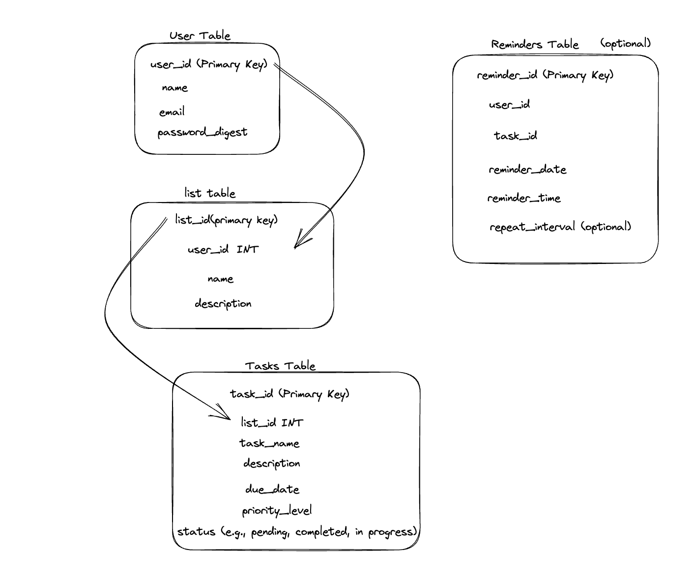

# Project Focus
A web app designed to help people with ADHD sort out their tasks in a simple format... with a few extra features to scratch that dopamine itch!
## :computer: [Click here](https://project-focus.onrender.com) to see my live project!
## :page_facing_up: About
- Just click the link above to try our web app!

## :pencil: Planning & Problem Solving
- We wanted to start by really nailing down our user stories and use those to inform the direction we wanted to take. You can see our work on those [here](./note/user_stories.md).
- Once we had a general idea of our goal, we broke the different areas down and split to work on some drafting for our general layout, app flow, and database schematics. You can find those in the [note/images](./note/images/) folder, but here's a few of the concepts we ended up with:
- Database Schematics:

- Home Page Layout:

- App Logic Flowchart:

- Once we cleared the sketching phase we buckled down and got our database connections up and running, setting up our PSQL and making sure our models and controllers had all the functionality we needed to move whatever data we needed, wherever we needed to move it.
- After that, the main trick of our project was setting up the flow of the app that we decided on with our user stories. This didn't go as well as we'd planned, as the original task/list creation flow didn't gel too smoothly with our API. We came to a workaround of storing lists & tasks in a browser-side state object with temporary "user" data until a user was actually signed in. We could then send everything to the database with the user's new information to retrieve later.
- Then came styling! Being an ADHD-oriented task management app we decided to work the layout into a simple, almost minimalistic "sticky-note" style that played to the theme of the app without too many distractions for our users, and we're really proud of what came out of that.
## :floppy_disk: Cool tech
- Node.js and Node Project Manager
- Single Page Application (SPA) structure for our front-end
- Express.js & PostgreSQL to create our own server-side 'API' for storing and retrieving tasks
- The Bored API to find random tasks to do if someone's stuck for ideas!
- The Advice Slip API so that people can get a little bit of advice if they need it.
- The Useless Facts API, because who doesn't love some random facts with their ADHD?
- A pixel art sandbox we added as a fun bonus!
## :wrench: Bugs to fix :space_invader:
- ~~State will only hold lists/tasks stored in the current session, need it to hold tasks/lists made in the current session AND the current user's tasks & lists~~
- App now grabs user lists/tasks on login, but need it to clear them on logout
- ~~Update/delete list crashes server if not signed in~~
- Task generator throws undefined if no tasks exist in the external API with the given parameters
- Viewing lists as a guest doesn't currently work
- Storing lists/tasks to state on login currently doesn't work
## :bulb: Lessons learnt
Things we learnt during development:
- How to work with Git for collaborative projects
- Keep the habit of planning at every stage of development, not just in the initial planning phase
- The basics of pair programming! A very helpful process for our group work
If I had to start this again from scratch I would:
- Focus on spreading the workload more evenly
- Set clearer boundaries as to what exactly needs to be done & where
- Dedicate more time to CSS styling rather than pure functionality
## :clipboard: Future features
If we were to continue expanding on this as a side project, we could:
- Work on making our app flow more naturally, it's still a bit broken up compared to our original concepts
- Bring the random generator APIs together into a single Random Stuff Generator so that it's all accessible from one page
- See how viable it would be to move functionality to the background of the app and turn the interface into a giant sketchpad!